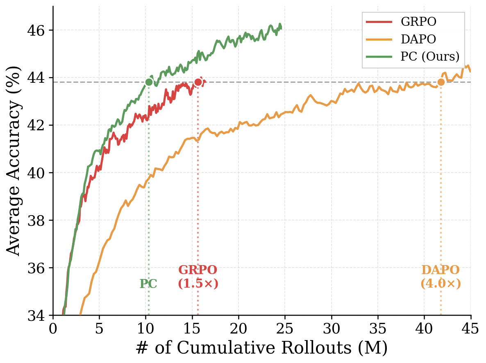
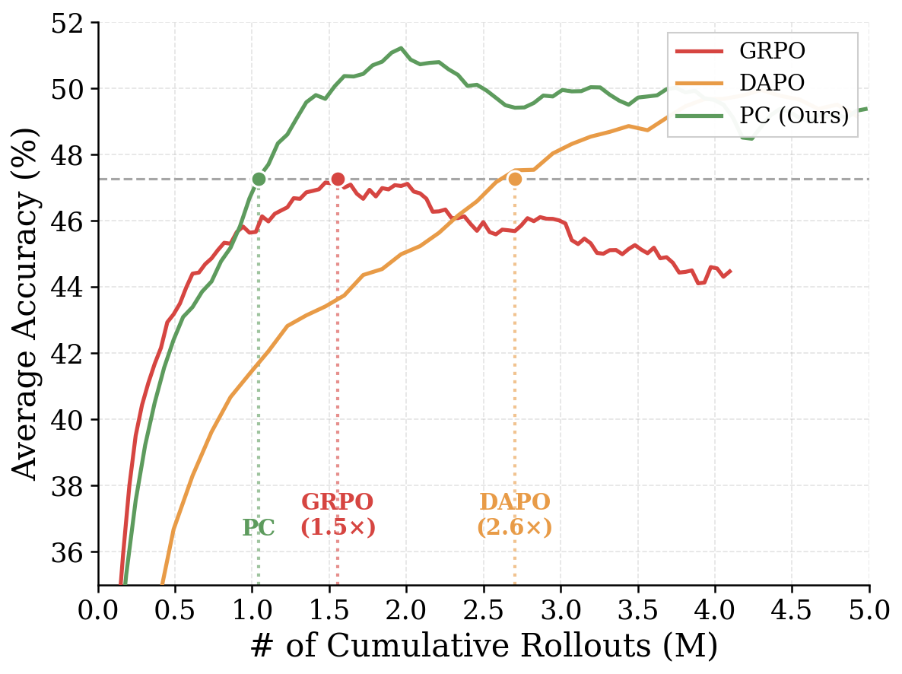
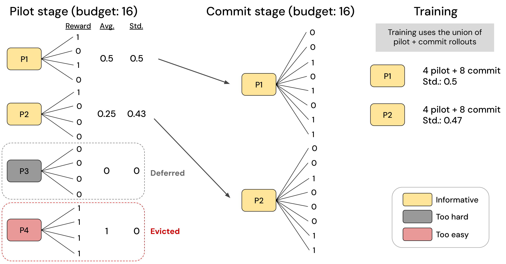

<div align="center">

<h1>Pilot-Commit: Spend Your Rollouts Where It Counts</h1>

<a href="https://arxiv.org"></a>

</div>

<p align="center">
<b>Woojeong Kim</b><sup>1,2</sup> · <b>Ziyi Yang</b><sup>1</sup> · <b>Jing Nathan Yan</b><sup>2</sup> · <b>Jialu Liu</b><sup>1</sup>
<br>
<sup>1</sup>Databricks · <sup>2</sup>Cornell University
</p>

|  |  |
|:---:|:---:|
| *Qwen2.5-1.5B-Math, DeepMath-103K (n=128)* | *Qwen3-8B, Polaris-53K (n=64)* |

**TL;DR**: We propose Pilot-Commit, a rollout allocation framework for group-based RL post-training that replaces uniform sampling with a targeted, budget-aware strategy—reaching baseline accuracy up to **1.9× faster** than GRPO and **4.0× faster** than DAPO in cumulative rollouts.

## Method

RL post-training for LLMs is bottlenecked by rollout generation. Group-based methods like GRPO compute advantages from multiple rollouts per prompt, yet allocate budget uniformly—wasting compute on prompts with collapsed reward distributions that yield no learning signal.

**Pilot-Commit** decouples prompt evaluation from exploitation:
- **Pilot stage**: Estimates per-prompt informativeness using a fraction of the budget
- **Commit stage**: Allocates remaining rollouts to high-leverage prompts while skipping low-signal prompts



*Overview of Pilot-Commit. In the pilot stage, a fraction of the rollout budget is used to estimate empirical reward variance per prompt. In the commit stage, the remaining budget is allocated to selected prompts. Prompts deemed too hard are deferred; prompts deemed too easy are evicted from future sampling.*

## Results

Cumulative rollouts to reach target accuracy (n = rollouts per prompt, M = million):

| Config | n | PC | GRPO | DAPO | vs GRPO | vs DAPO |
|--------|---|-----|------|------|---------|---------|
| 1.5B DeepMath | 128 | 10.6M | 16.0M | 42.0M | **1.5×** | **4.0×** |
| 4B Polaris | 64 | 1.7M | 2.5M | — | **1.5×** | — |
| 8B Polaris | 64 | 1.0M | 1.6M | 2.7M | **1.5×** | **2.6×** |
| 14B Polaris | 64 | 2.2M | 4.1M | 4.9M | **1.9×** | **2.3×** |

*— indicates DAPO did not reach target accuracy within the training budget.*

See paper for full results across exploration settings.

## Getting Started

Our implementation is based on [volcengine/verl](https://github.com/volcengine/verl).

### 1. Environment Setup

**Option A: Docker (recommended)**

Use a pre-built Docker image with all dependencies:

```bash
docker pull hiyouga/verl:ngc-th2.7.1-cu12.6-vllm0.10.0

docker create --runtime=nvidia --gpus all --net=host --shm-size="10g" \
    --cap-add=SYS_ADMIN -v .:/workspace --name pilot-commit \
    hiyouga/verl:ngc-th2.7.1-cu12.6-vllm0.10.0 sleep infinity
docker start pilot-commit
docker exec -it pilot-commit bash
```

Then inside the container:

```bash
cd /workspace
pip install --no-deps -e .
pip install math-verify==0.8.0 torch==2.7.1
pip install --upgrade 'pyarrow>=19.0.0'
```

**Option B: Custom environment**

Follow the [verl installation guide](https://verl.readthedocs.io/en/latest/start/install.html#install-from-custom-environment) to set up CUDA, cuDNN, and inference engines, then:

```bash
pip install --no-deps -e .
```

### 2. Download & Preprocess Data

```bash
bash data/e2e_process_data.sh
```

### 3. Training

**Qwen2.5-1.5B-Math on DeepMath-103K (2 nodes, n=128):**

```bash
# GRPO baseline
bash train_scripts/grpo_qwen2.5-1.5b_n128.sh

# DAPO baseline
bash train_scripts/dapo_qwen2.5-1.5b_n128.sh

# Pilot-Commit (ours)
bash train_scripts/pc_qwen2.5-1.5b_p32c96.sh
```

**Qwen3-4B on Polaris-53K (4 nodes, n=64):**

```bash
# GRPO baseline
bash train_scripts/grpo_qwen3-4b_n64.sh

# DAPO baseline
bash train_scripts/dapo_qwen3-4b_n64.sh

# Pilot-Commit (ours)
bash train_scripts/pc_qwen3-4b_p16c48.sh
```

See all scripts in `train_scripts/` folder.

## Core Implementation

The Pilot-Commit algorithm is implemented in `recipe/pc/`:

```
recipe/pc/
├── main_pc.py           # Entry point (Hydra)
├── pc_ray_trainer.py    # RayPCTrainer: pilot-commit training loop
├── replay_buffer.py     # Replay buffer for pilot survivors
├── utils.py             # Prompt selection utilities
└── config/
    └── pc_trainer.yaml  # Default configuration
```

### Key Components

**Pilot-Commit Trainer** (`pc_ray_trainer.py`):
- `RayPCTrainer` extends `RayPPOTrainer` with pilot-commit sampling logic
- Implements diversity-based prompt filtering
- Manages replay buffer for deferred prompts

**Configuration** (`config/pc_trainer.yaml`):
Key hyperparameters for Pilot-Commit:
```yaml
algorithm:
  diversity_threshold_upper: 0.25  # p_upper: skip prompts with success rate > threshold
  diversity_threshold_lower: 0.125 # p_lower: defer prompts with success rate < threshold
  exclude_threshold_upper: 1.0     # p_solve: evict prompts exceeding this threshold
  buffer_max_off_steps: 4          # Maximum staleness for replay buffer
  exploration:
    n: 8                           # Number of pilot rollouts per prompt
```

## Citation

If you find this work useful, please cite:

```bibtex
@article{kim2025pilotcommit,
  title   = {Spend Your Rollouts Where It Counts: Rollout Allocation for Group-Based RL Post-Training},
  author  = {Kim, Woojeong and Yang, Ziyi and Yan, Jing Nathan and Liu, Jialu},
  year    = {2025},
  journal = {arXiv preprint}
}
```

## Acknowledgements

This implementation is built on top of [verl](https://github.com/volcengine/verl) (HybridFlow). We thank the verl team for their excellent RL training framework.
